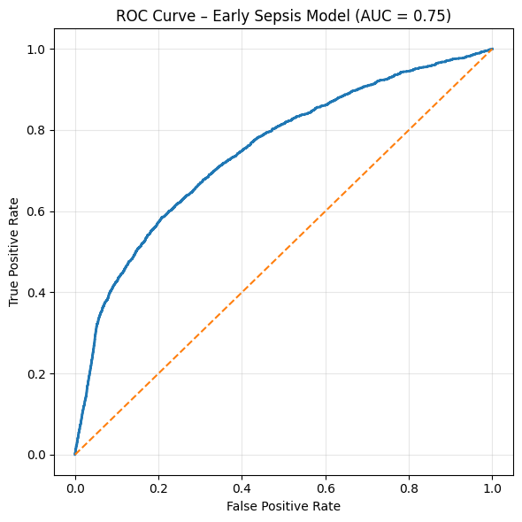
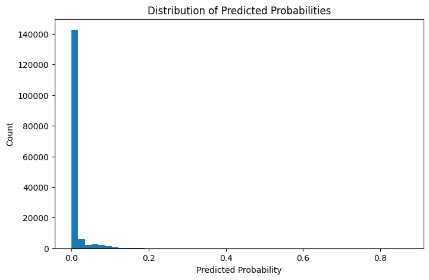
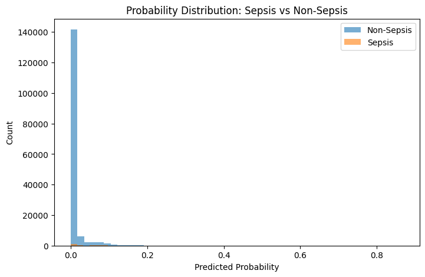

## Model ROC Curve

## Risk Trajectory – Septic Patient

## Risk Trajectory – Non-Septic Patient

## Threshold Tradeoff

 
## Probability Distribution

Most predictions are near zero due to the low prevalence of sepsis (~2%).  
The model assigns higher probabilities to physiologically unstable patients.

---

## Sepsis vs Non-Sepsis Probability

Septic patients tend to receive higher predicted probabilities, though
there is overlap between the distributions. This reflects the difficulty
of early sepsis prediction using physiological signals alone.

### Latest Model Update

Recent improvements include additional clinically meaningful features:

• Shock Index (HR / SBP)  
• Baseline Vital Deviation  
• Lab Test Presence Indicators  
• Vital Instability (Rolling Standard Deviation)

These additions improved model discrimination and alert reliability.

Updated Performance:

ROC-AUC ≈ 0.756  
PR-AUC ≈ 0.040  

Patient-Level Alert System:

Precision ≈ 0.62  
Recall ≈ 0.42  

The alert system includes:

• Probability threshold filtering  
• 2-hour persistence rule  
• Alert cooldown mechanism

